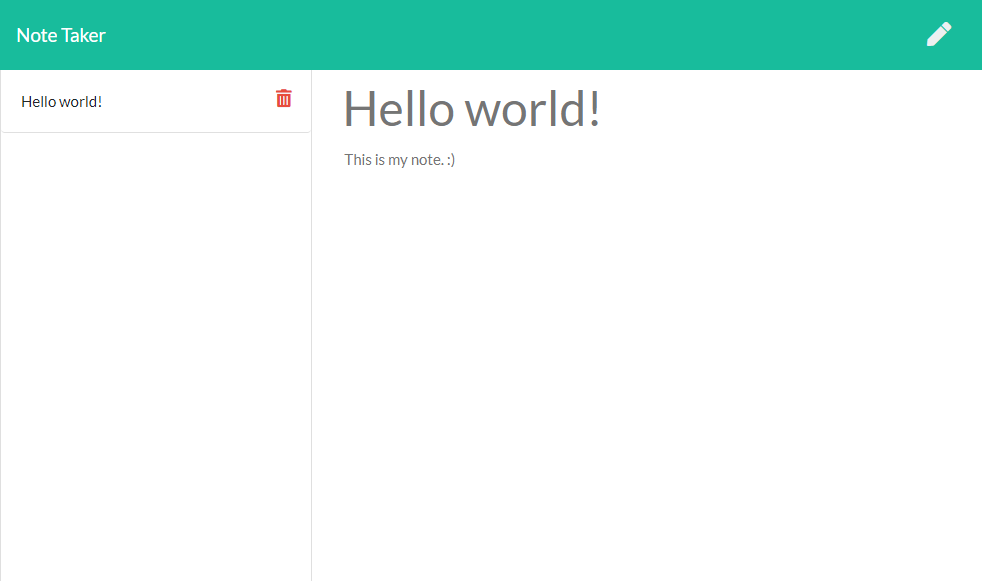

# Note Taker

## Introduction

Ever thought of something and wanted to have it written down before you forgot? Use this simple note taker web app to write down and save your notes!

[Live Demo](https://stark-sea-89358.herokuapp.com/)

*Disclaimer: Please note this live demo is a public web app. The notes expressed in this live demo are those of the author and do not necessarily reflect the views or opinions of the creator(s) of this web app. If you see any notes that are suspect to be malicious or hateful, please take the initative and delete those notes.*

## Installation

**Note.js v13+** is required in order to run this script.

1. Download or clone this repository into your local computer.
2. In your terminal, browse to the folder and run `npm install --production`.

## Usage

1. In your terminal, run the script with the command `node index.js`. This will run a local server that hosts the web app on port 8080.
2. Visit `http://localhost:8080` to access the web app.
3. Write a title and text into the note form and click on the disk icon to save the note.
4. Click on the note on the left sidebar to view the note.

## Preview

